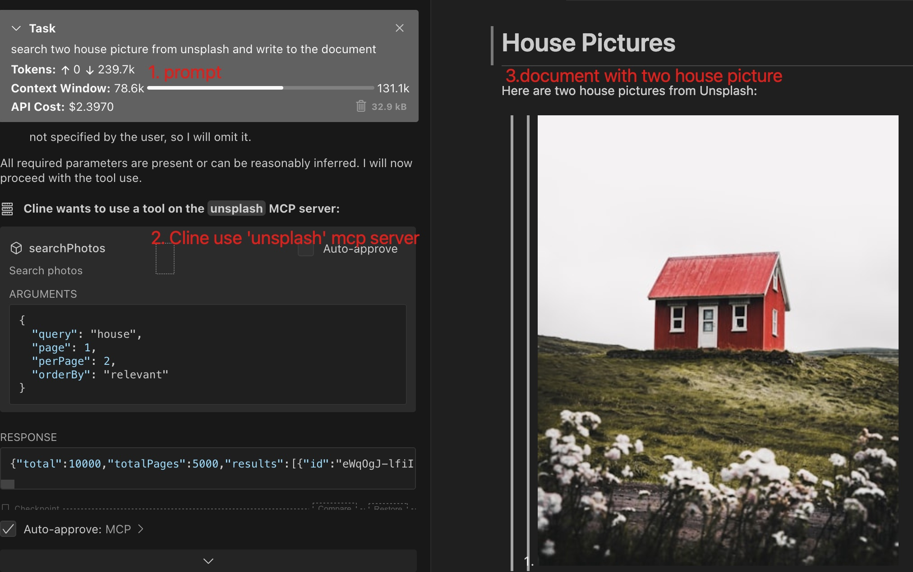

# Unsplash MCP Server
- With this mcp server, you can easily search picture from **[unsplash](https://unsplash.com/)**
- With this project, you can easily learn how to write MCP Server with JAVA
> **search two house picture from unsplash** and write to the document

## Feature



## How to use

1. Clone this project
```
git clone https://github.com/JavaProgrammerLB/unsplash-mcp-server.git
```

2. Build
```
cd unsplash-mcp-server
mvn clean package
```
3. Get Unsplash Access Key
- visit [unsplash](https://unsplash.com/developers)
- create an unsplash application
- find out the access key in unsplash application detail page

4. Config MCP Server
```
{
  "mcpServers": {
    "unsplash": {
      "command": "java",
      "args": [
        "-Dspring.ai.mcp.server.stdio=true",
        "-Dspring.main.web-application-type=none",
        "-Dlogging.pattern.console=",
        "-jar",
        "/ABSOLUTE/PATH/target/unsplash-mcp-server-1.0.jar"
      ],
      "env": {
        "UNSPLASH_ACCESS_KEY": "${YOUR UNSPLASH ACCESS KEY}"
      }
    }
  }
}
```

Thanks
- [Python Version Unsplash MCP Server](https://github.com/hellokaton/unsplash-mcp-server)
